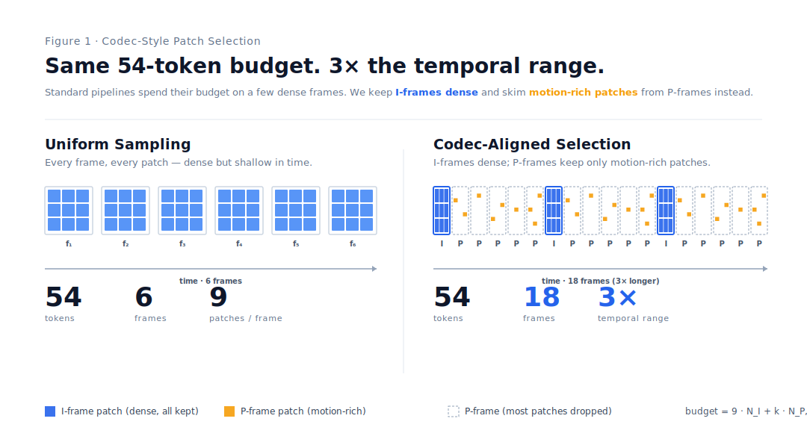
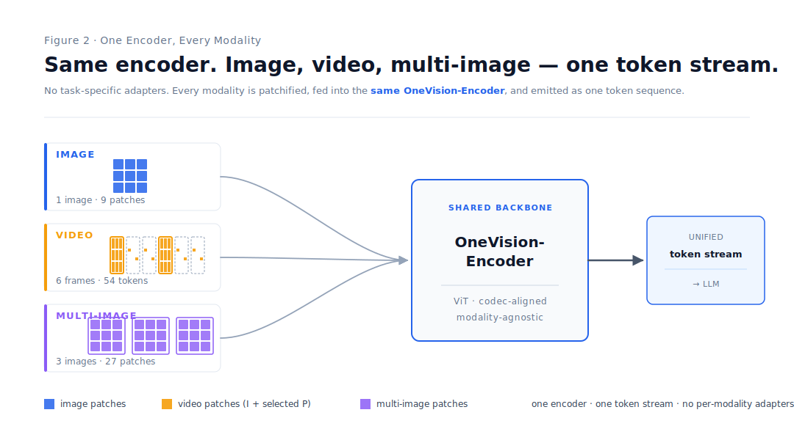

<p align="center">
  <picture>
    <source media="(prefers-color-scheme: dark)" srcset="asset/llava_onevision_2_black.svg">
    <source media="(prefers-color-scheme: light)" srcset="asset/llava_onevision_2_white.svg">
    
  </picture>
</p>

<p align="center">
  <strong>Fully Open Framework for Democratized Multimodal Training</strong>
</p>


<div align="center">

🤗 **[Models and Datasets](https://huggingface.co/collections/lmms-lab/llava-onevision-15-68d385fe73b50bd22de23713)** |
🖥️ **[Demo](https://huggingface.co/spaces/lmms-lab/LLaVA-OneVision-1.5)** |
📄 **[Technical Report](https://arxiv.org/abs/2509.23661)** |
📰 **[Zhihu](https://www.zhihu.com/question/1959577143697707446)** |
📕 **[Xiaohongshu](http://xhslink.com/o/4nXL6EXDTqv)**

</div>

---

<p align="center">
  <!-- Mid-Training Dataset Downloads -->
  <a href="https://huggingface.co/datasets/mvp-lab/LLaVA-OneVision-1.5-Mid-Training-85M">
    
  </a>
  <!-- Instruct Dataset Downloads -->
  <a href="https://huggingface.co/datasets/mvp-lab/LLaVA-OneVision-1.5-Instruct-Data">
    
  </a>
  <!-- Model Downloads -->
  <a href="https://huggingface.co/lmms-lab/LLaVA-OneVision-1.5-8B-Instruct">
    
  </a>
  <!-- Training Cost -->
  
  <!-- Paper Citations -->
  <a href="https://scholar.google.com/scholar_lookup?arxiv_id=2509.23661">
    
  </a>
  <!-- License -->
  <a href="LICENSE">
    
  </a>
  <!-- PRs Welcome -->
  <a href="https://github.com/EvolvingLMMs-Lab/LLaVA-OneVision-1.5/pulls">
    
  </a>
  <!-- Commit Activity -->
  <a href="https://github.com/EvolvingLMMs-Lab/LLaVA-OneVision-1.5/commits">
    
  </a>
  <!-- Contributors -->
  <a href="https://github.com/EvolvingLMMs-Lab/LLaVA-OneVision-1.5/graphs/contributors">
    
  </a>
  <!-- Megatron-LM Optimization -->
  <a href="https://github.com/NVIDIA/Megatron-LM">
    
  </a>
  <!-- ModelScope Collection -->
  <a href="https://www.modelscope.cn/collections/LLaVA-OneVision-15-ff6ede3d20a643" target="_blank">
    
  </a>
</p>

---


## NEWS
- 2026-04-30: Released LLaVA-OneVision-2.0 — next-generation multimodal model, with new [LLaVA-OneVision-2.0-VideoCaption](#datasets) and [LLaVA-OneVision-2.0-Spatial](#datasets) datasets.
- 2026-02-10: Released [OneVision-Encoder](https://huggingface.co/collections/lmms-lab-encoder/onevision-encoder-6978aeb2bbe1aa13fad12d4c) — codec-aligned vision encoders, with [Technical Report](https://arxiv.org/abs/2602.08683).
- 2025-12-11: Released RL recipe for LLaVA-OneVision-1.5, with [Project](https://mvp-ai-lab.github.io/LLaVA-OneVision-1.5-RL/), [Code](https://github.com/EvolvingLMMs-Lab/LLaVA-OneVision-1.5-RL), [Data](https://huggingface.co/datasets/mvp-lab/LLaVA-OneVision-1.5-RL-Data), and [Model](https://huggingface.co/mvp-lab/LLaVA-OneVision-1.5-8B-RL).
- 2025-09-30: Released the LLaVA-OneVision-1.5 [Technical Report](https://arxiv.org/abs/2509.23661).


## Contents
<!-- TOC -->
- [Introduction](#introduction)
- [Method](#method)
- [Models](#models)
- [Datasets](#datasets)
- [Results](#evaluation-results)
- [Citation](#citation)
- [Acknowledgement](#acknowledgement)


## Introduction

**LLaVA-OneVision-2.0** is the next-generation release of the LLaVA-OneVision family — a fully open 8B multimodal model that unifies image, long-form video, and spatial understanding under a single architecture, with the entire pipeline (data, encoders, training, checkpoints, logs) released end-to-end.

### 🎬 Codec-Aligned Vision Encoders

Forget uniform patchification. **OneVision-Encoder** and **OneVision-Encoder-Lang** are HEVC-style vision transformers that treat video like a codec stream — selecting only motion- and residual-rich patches and sampling dense frames sparsely instead of sparse frames densely. The result is dramatically longer temporal coverage under the same token budget, where prior ViT backbones simply run out of context.

### 🧊 One Model, Every Modality

Most open multimodal models still live in a 2D, single-image world. **LLaVA-OneVision-2.0-8B-Instruct** breaks out of it — one model, native resolution, no task-specific adapters, no hidden tricks.

- **Long video** — multi-frame reasoning with efficient codec-aligned inference
- **3D-aware spatial reasoning** — depth, layout, object relations
- **Documents, OCR, charts** — structured visual inputs at native resolution

New open-source SOTA across a broad suite of multimodal benchmarks.

### 🚀 Fully Open, Reproducible from Day One

Four datasets ship with the LLaVA-OneVision family — two new for 2.0, two carried forward from 1.5:

- **LLaVA-OneVision-2.0-VideoCaption** — extremely dense video captions
- **LLaVA-OneVision-2.0-Spatial** — 3D-aware spatial reasoning
- **LLaVA-OneVision-1.5-Mid-Training-85M** — 85M concept-balanced mid-training corpus
- **LLaVA-OneVision-1.5-Instruct** — full instruction-tuning mixture

And unlike most "open" releases, *everything* ships alongside them: encoder weights, training code, configs, and full training logs. Reproducible end to end.


## Method

### Codec-Style Patch Selection

<p align="center">
  
</p>

Standard video pipelines uniformly sample a handful of frames and process **every** patch — most of it static background. We borrow from HEVC: keep **I-frames** dense, keep only **motion- and residual-rich patches** from **P-frames**. Same 54-token budget, **18 frames** instead of 6 — 3× the temporal range, no extra LLM context, no input-type adapters.

### One Encoder, Every Modality

<p align="center">
  
</p>

Most multimodal stacks ship a different tokenizer per input type — one path for images, another for video, a third for multi-image. We don't. **Image, video, and multi-image inputs are all patchified and fed into the same OneVision-Encoder**, then emitted as a single unified token stream to the LLM. No task-specific adapters, no per-modality branching, no hidden routing.


## Models

| Model                           | HF Link                                                                                               | Training Log                                                                                 |
| ------------------------------- | ----------------------------------------------------------------------------------------------------- | -------------------------------------------------------------------------------------------- |
| LLaVA-OneVision-2.0-8B-Instruct | —                                                                                                     | —                                                                                            |
| LLaVA-OneVision-2.0-4B-Instruct | —                                                                                                     | —                                                                                            |
| LLaVA-OneVision-1.5-4B-Instruct | [🤗 HF / 4B-Instruct](https://huggingface.co/lmms-lab/LLaVA-OneVision-1.5-4B-Instruct)                 | [📈 TensorBoard](https://huggingface.co/lmms-lab/LLaVA-OneVision-1.5-4B-Instruct/tensorboard) |
| LLaVA-OneVision-1.5-8B-Instruct | [🤗 HF / 8B-Instruct](https://huggingface.co/lmms-lab/LLaVA-OneVision-1.5-8B-Instruct)                 | [📈 TensorBoard](https://huggingface.co/lmms-lab/LLaVA-OneVision-1.5-8B-Instruct/tensorboard) |
| OneVision-Encoder               | [🤗 HF / OneVision-Encoder](https://huggingface.co/lmms-lab-encoder/onevision-encoder-large)           | —                                                                                            |
| OneVision-Encoder-Lang          | [🤗 HF / OneVision-Encoder-Lang](https://huggingface.co/lmms-lab-encoder/onevision-encoder-large-lang) | —                                                                                            |

## Datasets

| Description                          | Link                                                                                                   | Status    |
| ------------------------------------ | ------------------------------------------------------------------------------------------------------ | --------- |
| LLaVA-OneVision-2.0-VideoCaption     | —                                                                                                      | Available |
| LLaVA-OneVision-2.0-Spatial          | —                                                                                                      | Available |
| LLaVA-OneVision-1.5-Mid-Training-85M | [🤗HF / Mid-Training 85M](https://huggingface.co/datasets/mvp-lab/LLaVA-OneVision-1.5-Mid-Training-85M) | Available |
| LLaVA-OneVision-1.5-Instruct         | [🤗HF / Instruct-Data](https://huggingface.co/datasets/mvp-lab/LLaVA-OneVision-1.5-Instruct-Data)       | Available |


## Evaluation Results


All evaluations were conducted using [lmms_eval](https://github.com/EvolvingLMMs-Lab/lmms-eval).


## Contributors
Thanks so much to all of our amazing contributors!

<!-- readme: collaborators,contributors,jiankangdeng/- -start -->
<table>
	<tbody>
		<tr>
            <td align="center">
                <a href="https://github.com/fengshikun">
                    
                    <br />
                    <sub><b>fengshikun</b></sub>
                </a>
            </td>
            <td align="center">
                <a href="https://github.com/GeoffreyChen777">
                    
                    <br />
                    <sub><b>GeoffreyChen777</b></sub>
                </a>
            </td>
            <td align="center">
                <a href="https://github.com/fdcp">
                    
                    <br />
                    <sub><b>fdcp</b></sub>
                </a>
            </td>
            <td align="center">
                <a href="https://github.com/Luodian">
                    
                    <br />
                    <sub><b>Luodian</b></sub>
                </a>
            </td>
            <td align="center">
                <a href="https://github.com/mathCrazyy">
                    
                    <br />
                    <sub><b>mathCrazyy</b></sub>
                </a>
            </td>
            <td align="center">
                <a href="https://github.com/anxiangsir">
                    
                    <br />
                    <sub><b>anxiangsir</b></sub>
                </a>
            </td>
            <td align="center">
                <a href="https://github.com/didizhu-judy">
                    
                    <br />
                    <sub><b>didizhu-judy</b></sub>
                </a>
            </td>
            <td align="center">
                <a href="https://github.com/yiyexy">
                    
                    <br />
                    <sub><b>yiyexy</b></sub>
                </a>
            </td>
		</tr>
		<tr>
            <td align="center">
                <a href="https://github.com/yshenaw">
                    
                    <br />
                    <sub><b>yshenaw</b></sub>
                </a>
            </td>
            <td align="center">
                <a href="https://github.com/Yangsenqiao">
                    
                    <br />
                    <sub><b>Yangsenqiao</b></sub>
                </a>
            </td>
            <td align="center">
                <a href="https://github.com/kcz358">
                    
                    <br />
                    <sub><b>kcz358</b></sub>
                </a>
            </td>
            <td align="center">
                <a href="https://github.com/YunyaoYan">
                    
                    <br />
                    <sub><b>YunyaoYan</b></sub>
                </a>
            </td>
            <td align="center">
                <a href="https://github.com/FeilongTangmonash">
                    
                    <br />
                    <sub><b>FeilongTangmonash</b></sub>
                </a>
            </td>
            <td align="center">
                <a href="https://github.com/wkzhang636">
                    
                    <br />
                    <sub><b>wkzhang636</b></sub>
                </a>
            </td>
            <td align="center">
                <a href="https://github.com/chengzheng345">
                    
                    <br />
                    <sub><b>chengzheng345</b></sub>
                </a>
            </td>
            <td align="center">
                <a href="https://github.com/Jinghao-Guo">
                    
                    <br />
                    <sub><b>Jinghao-Guo</b></sub>
                </a>
            </td>
		</tr>
		<tr>
            <td align="center">
                <a href="https://github.com/wideyard">
                    
                    <br />
                    <sub><b>wideyard</b></sub>
                </a>
            </td>
            <td align="center">
                <a href="https://github.com/Lornatang">
                    
                    <br />
                    <sub><b>Lornatang</b></sub>
                </a>
            </td>
            <td align="center">
                <a href="https://github.com/killTheHostage">
                    
                    <br />
                    <sub><b>killTheHostage</b></sub>
                </a>
            </td>
            <td align="center">
                <a href="https://github.com/yunglechao">
                    
                    <br />
                    <sub><b>yunglechao</b></sub>
                </a>
            </td>
            <td align="center">
                <a href="https://github.com/RobitYadda">
                    
                    <br />
                    <sub><b>RobitYadda</b></sub>
                </a>
            </td>
		</tr>
	<tbody>
</table>
<!-- readme: collaborators,contributors,jiankangdeng/- -end -->

## Citation

If you find *LLaVA-OneVision-1.5* useful in your research, please consider to cite the following related papers:

```
@inproceedings{LLaVA-OneVision-2.0,
  title={LLaVA-OneVision-2.0},
  author={TODO: fill author list from contributors},
  booktitle={arXiv},
  year={2026}
}

@inproceedings{LLaVA-OneVision-1.5,
  title={LLaVA-OneVision-1.5: Fully Open Framework for Democratized Multimodal Training},
  author={An, Xiang and Xie, Yin and Yang, Kaicheng and Zhang, Wenkang and Zhao, Xiuwei and Cheng, Zheng and Wang, Yirui and Xu, Songcen and Chen, Changrui and Wu, Chunsheng and Tan, Huajie and Li, Chunyuan and Yang, Jing and Yu, Jie and Wang, Xiyao and Qin, Bin and Wang, Yumeng and Yan, Zizhen and Feng, Ziyong and Liu, Ziwei and Li, Bo and Deng, Jiankang},
  booktitle={arXiv},
  year={2025}
 }

@article{tang2026onevisionencoder,
  title={OneVision-Encoder: Codec-Aligned Sparsity as a Foundational Principle for Multimodal Intelligence},
  author={Tang, Feilong and An, Xiang and Yan, Yunyao and Xie, Yin and Qin, Bin and Yang, Kaicheng and Shen, Yifei and Zhang, Yuanhan and Li, Chunyuan and Feng, Shikun and Chen, Changrui and Tan, Huajie and Hu, Ming and Zhang, Manyuan and Li, Bo and Feng, Ziyong and Liu, Ziwei and Ge, Zongyuan and Deng, Jiankang},
  journal={arXiv preprint arXiv:2602.08683},
  year={2026}
}

@article{lillava,
  title={LLaVA-OneVision: Easy Visual Task Transfer},
  author={Li, Bo and Zhang, Yuanhan and Guo, Dong and Zhang, Renrui and Li, Feng and Zhang, Hao and Zhang, Kaichen and Zhang, Peiyuan and Li, Yanwei and Liu, Ziwei and Li, Chunyuan},
  journal={Transactions on Machine Learning Research}
  year={2024}
}
```

## Acknowledgement

We extend our sincere gratitude to **AIAK team of the** [**Baige AI computing platform**](https://cloud.baidu.com/product/aihc.html) **from Baidu AI Cloud** for providing the exceptional training framework. The outstanding capabilities of AIAK-Training-LLM and AIAK-Megatron have significantly accelerated our training process with remarkable efficiency. These cutting-edge frameworks have been instrumental in achieving our research goals. `To get full AIAK support, you can contact Baidu Cloud.`

We acknowledge the support of [Synvo AI](https://synvo.ai/) for contributing to the partial data annotation in this work, and also thank the maintainers and contributors of the following open-source projects, whose work greatly inspired and supported our research:

- LLaVA: Large Language-and-Vision Assistant — [LLaVA](https://github.com/haotian-liu/LLaVA)
- LLaVA-NeXT: Next-generation multi-modal assistant — [LLaVA-NeXT](https://github.com/LLaVA-VL/LLaVA-NeXT)
- lmms-eval: A standardized evaluation framework for Large Multimodal Models — [lmms-eval](https://github.com/EvolvingLMMs-Lab/lmms-eval)
- Megatron-LM: Efficient, scalable training for large language models — [Megatron-LM](https://github.com/NVIDIA/Megatron-LM)
- Qwen2.5-VL: Strong vision-language foundation model — [Qwen2.5-VL](https://github.com/QwenLM/Qwen2.5-VL)
- InternVL: Open-source large-scale vision-language foundation model — [InternVL](https://github.com/OpenGVLab/InternVL)
- Qwen3: Next-generation Qwen LLM — [Qwen](https://github.com/QwenLM/Qwen)
- MetaCLIP: Scalable contrastive pretraining — [MetaCLIP](https://github.com/facebookresearch/MetaCLIP)
- FineVision: Open Data Is All You Need — [FineVision](https://huggingface.co/spaces/HuggingFaceM4/FineVision)
